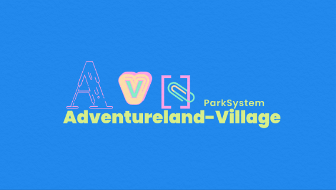
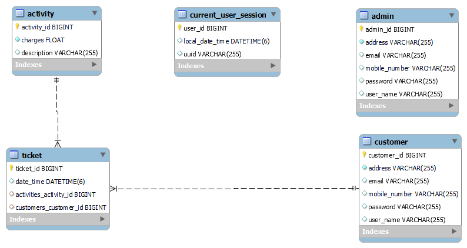

# AdventureLand Village

AdventureLand Village is an amusement park  that features various attractions, such as rides and games, as well as other events for entertainment purposes. A theme park is a type of amusement park that bases its structures and attractions around a central theme, often featuring multiple areas with different themes.

The application is built for 2 types of users :

    1. Admin
    2. Customer
    
Functionalities Of Admin :

    - Register   
    - Login
    - Update Profile
    - Add Different Slots
    - Add Different Activity
    - Connect slots with activity
    - Remove Activity
    - Remove Customer
    
 Functionalities Of Customer :

    - Register
    - Login
    - Update Profile
    - Book Ticket
    - Update Ticket Details
    - Remove Ticket
    
    # ER Diagram

<h2>API End Point <a href="http://localhost:8082/swagger-ui.html">http://localhost:8082/swagger-ui.html</a></h2>
<h2>Tech Stack</h2>
<ul>
  <li>Java</li>
  <li>SpringBoot</li>
  <li>SpringData JPA</li>
  <li>Lombok</li>
  <li>MySQL</li>
  <li>Hibernate</li> 
  <li>Maven</li>
</ul>

 Contributors:-
 
 - [@Neha Jaiswal](https://github.com/neha-hue)
 - [@Tahir Manzoor](https://github.com/TahiR-ManzooR-110)
 - [@Saurabh Kumar](https://github.com/rajsaurabh78)
 - [@Ashish Tripathy](https://github.com/malonicester)
 - [@Vishal Girhepunje](https://github.com/vishal-girhepunje)
    
   
