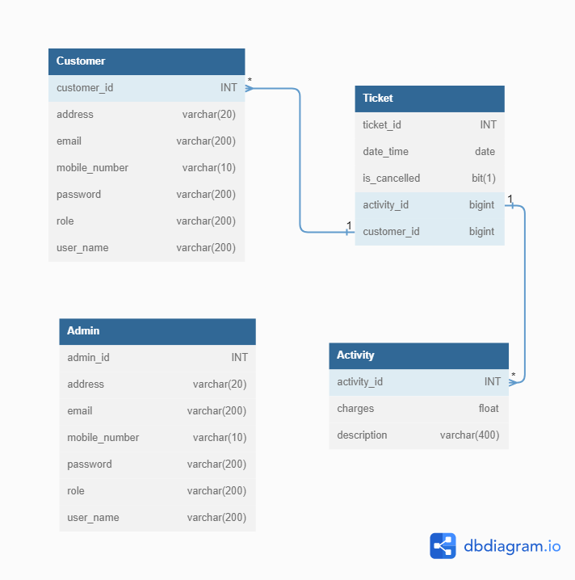
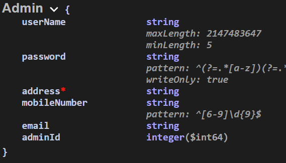
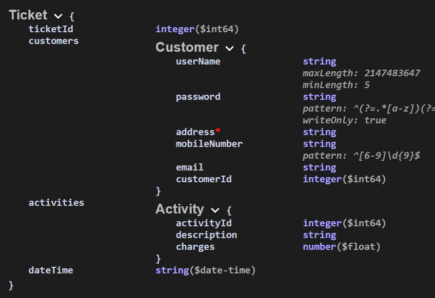
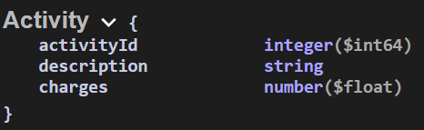

# AdventureLand Village

AdventureLand Village is an amusement park that features various attractions, such as rides and games, as well as other events for entertainment purposes. A theme park is a type of amusement park that bases its structures and attractions around a central theme, often featuring multiple areas with different themes.

The application is built for 2 types of users :
<h2>  1. Admin</h2>
<h2>  2. Customer</h2>
    
# Functionalities Of Admin :

- Admin Register   
- Admin Login
- Admin Update Profile
- Admin-Activity
  - Add Activity
  - Update Activity
  - Delete Activity
  - View Activity with Charges
  - Count All Activity
- Admin-Customer
  - Add Customer
  - Update Customer Details
  - Delete Customer(Id)
  - View Customer by Id and Get All List
  - Validate Customer
    
# Functionalities Of Customer :
- Customer Register
- Customer Login
- Customer Update Profile
- Customer Book Ticket
- Customer Update Ticket Details like change activities, add multiple activities, delete activities etc.
- Cancel the Ticket

# Authentication
- When a user admin/customer is logged in, a JWT Token is generated which is used for Authorization.

 # ER Diagram

# Entity Schema

 

<h2>API End Point <a href="http://localhost:8082/swagger-ui/index.html#/">http://localhost:8082/swagger-ui/index.html#/</a></h2>
<h2>Tech Stack</h2>
<ul>
  <li>Java</li>
  <li>SpringBoot</li>
  <li>SpringData JPA</li>
  <li>Spring Security</li>
  <li>Lombok</li>
  <li>MySQL</li>
  <li>Hibernate</li> 
  <li>Maven</li>
</ul>

 Contributors:-
 
 - [@Neha Jaiswal](https://github.com/neha-hue)
 - [@Tahir Manzoor](https://github.com/TahiR-ManzooR-110)
 - [@Saurabh Kumar](https://github.com/rajsaurabh78)
 - [@Ashish Tripathy](https://github.com/malonicester)
 - [@Vishal Girhepunje](https://github.com/vishal-girhepunje)
    
   
